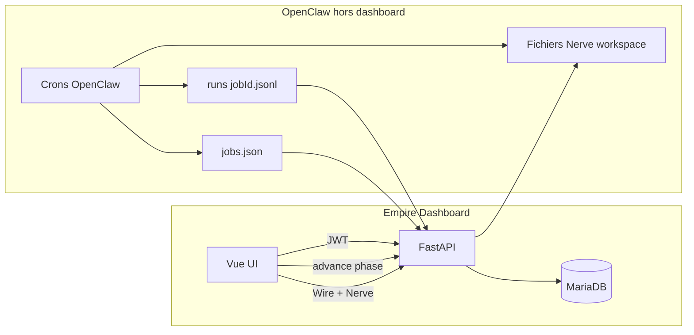

# Empire Dashboard — Fonctionnement, agents, OpenClaw et validation humaine

Ce document décrit ce que fait l’application, comment les agents et OpenClaw s’articulent, et où intervenir pour intégrer **validation** et **visualisation humaine** dans le workflow.

---

## 1. Rôle de l’application

**Empire Dashboard** est une interface de pilotage : authentification JWT, données en **MariaDB**, fichiers optionnels en **MinIO**. Elle ne fait pas tourner les LLM elle-même : elle **affiche** l’état du « crew », des KPIs (souvent issus du seed), un **workflow par phases**, des **modules ops** (niches, contenu, SEO, demandes de clés API), le **Wire** (fil de messages / sorties agents), le **Nerve center** (fichiers de contrat / mémoire par agent), et une **supervision** des crons OpenClaw lorsqu’un volume de données OpenClaw est monté.

Les **agents** sont surtout des **entités métier** en base (`agents`, tâches, messages wire, etc.), alignées sur une fiction d’orchestration ; l’exécution réelle des jobs est supposée **côté OpenClaw** (crons) ou scripts externes.

---

## 2. Où vit la logique workflow aujourd’hui

### 2.1 Phases (métier)

Les 10 phases et les agents « actifs » par phase sont **figés en Python** dans `backend/app/workflow_phases.py` (`PHASES` : index, titre, résumé, liste `agents`).

### 2.2 État persisté

Une seule ligne d’état (`WorkflowStateModel`, id fixe `1`) contient notamment :

- `phase` (1 à 10)
- `last_validated_at` (horodatage après une action humaine de validation de phase)

Les endpoints `GET` / `POST` sous `/api/workflow` exposent la phase courante, la définition de phase, et `lit_agent_ids` (les ids agents de la phase en cours) pour l’UI (Timeline, Crew).

### 2.3 Action humaine actuelle sur le workflow

- **`POST /api/workflow/advance`** : incrémente la phase (plafonnée à 10), met à jour `last_validated_at`.
- **`POST /api/workflow/reset`** : repasse à la phase 1.

Il n’y a **pas** de lien automatique avec l’activation ou la désactivation des crons OpenClaw dans ce code : la validation de phase est **uniquement** un curseur côté dashboard.

---

## 3. OpenClaw — branchement dans le dashboard

### 3.1 Données sur disque (`OPENCLAW_DIR`)

Le service `backend/app/services/openclaw_cron.py` lit un répertoire (souvent monté en volume Docker, ex. `/openclaw-data`) :

- `cron/jobs.json` — liste des jobs / crons
- `cron/runs/{jobId}.jsonl` — **une ligne JSON = un run** (résumé, statut, usage tokens, etc.)

La table **`AGENTS_MAP`** (dans le même fichier) lie :

- une **clé** métier (`marlene`, `marcel_x`, …)
- un **`jobId`** UUID OpenClaw
- un **`dashboard_agent_id`** (ex. `marlene`, `marcel`, `edith`, `yvon`)

Les entrées sans `jobId` valide apparaissent comme non configurées dans les agrégations OpenClaw.

### 3.2 Supervision API

`GET /api/supervision/openclaw` et `GET /api/supervision/openclaw/agents` lisent **`jobs.json` et les runs** sous `openclaw_dir` (implémentation orientée fichiers dans `backend/app/routers/supervision.py`).

**Note** : [DEPLOY.md](../DEPLOY.md) mentionne aussi `OPENCLAW_GATEWAY_URL` et un appel type `GET {gateway}/api/status`. Les variables existent dans `backend/app/config.py`, mais la route `/api/supervision/openclaw` actuelle s’appuie sur le **filesystem**. Le bandeau OpenClaw du dashboard (`frontend/src/views/DashboardView.vue`) attend des champs du type `jobs_in_file` / `last_run_status_counts` qui peuvent ne pas correspondre exactement au JSON renvoyé par cette route : à harmoniser si vous unifiez sur le gateway ou sur le fichier.

### 3.3 Wire (fil équipe)

- **`GET /api/wire/conversations`** : si le volume OpenClaw est présent, les « conversations » viennent des **`runs/{jobId}.jsonl`** (aperçu = dernier run). Sinon, fallback sur les conversations en **base** (`WireConversationModel`).
- **`GET /api/wire/conversations/{id}/messages`** : si `id` est un UUID de job OpenClaw, les messages correspondent aux **lignes du jsonl**, fusionnées avec d’éventuels messages **DB** pour le même `openclaw_job_id`.
- **`POST /api/wire/messages`** : message humain vers un agent. En mode conversation OpenClaw, stockage en DB et, si `push_to_nerve` est vrai, **`append_nerve_note`** (`backend/app/services/wire_outbound.py`) ajoute un bloc daté dans **HEARTBEAT** (table `nerve_files` ou fichiers sous `OPENCLAW_DIR`) pour que les **crons** puissent lire le feedback.

### 3.4 Nerve center

- Mode **`database`** (défaut) : contenu dans `nerve_files`.
- Mode **`filesystem`** : lecture/écriture sous `OPENCLAW_DIR` selon `OPENCLAW_NERVE_AGENT_PATHS` / template (voir DEPLOY.md).

Slugs : `identity`, `soul`, `memory`, `agents`, `heartbeat` (`NERVE_SLUGS` dans `workflow_phases.py`).

### 3.5 Crons affichés (Timeline)

`GET /api/ops/crons` renvoie une liste **statique** `WORKFLOW_CRONS` dans `backend/app/routers/ops.py` (documentation / alignement conceptuel), **sans** lecture live des UUID OpenClaw.

---

## 4. Interactions agents sans OpenClaw (machine → dashboard)

- **`POST /api/internal/tasks`** avec le header `X-Empire-Internal-Key` (si `EMPIRE_INTERNAL_API_KEY` est défini) : création de tâches pour scripts ou intégrations.
- **Ops** : niches, pipeline contenu, SEO, demandes de clés API — données **DB** ; décision humaine déjà possible sur les demandes API via `PATCH /api/ops/api-requests/{id}`.
- **`POST /api/wire/webhook`** : authentification par secret (`empire_jwt_secret`) ; crée une conversation du jour et un message (push depuis l’extérieur sans passer par les fichiers OpenClaw).

---

## 5. Schéma du flux actuel

Les agents « exécutent » hors de cette app ; le dashboard **observe** (runs, supervision), **oriente** (phase, nerve, wire → heartbeat), et **persiste** des artefacts (tâches, wire, ops).

---

## 6. Pistes pour validation et visualisation humaine

### 6.1 Niveau phase (Timeline)

- Étendre le modèle d’état : `pending_review`, file d’attente de livrables par phase, ou historique des validations.
- Enchaînement possible : **soumettre** → **revue UI** → **approuver** → alors seulement `advance` (ou appel externe pour débloquer OpenClaw).
- Exposer un `GET` agrégé des livrables de la phase (derniers runs des jobs concernés, niches, etc.).

### 6.2 Niveau run OpenClaw (jsonl)

- Soit des champs dans chaque ligne JSON (si vous contrôlez le schéma côté OpenClaw), soit une **table DB** `(job_id, run_ts, human_status)` pour ne pas modifier les jsonl.

### 6.3 Wire / Nerve

- Statuts sur messages ou threads (approuvé / à retravailler), stockés en DB et réinjectés dans Nerve ou dans une section dédiée lue par les prompts.

### 6.4 Données métier (ops)

- Statuts type `awaiting_human` / `approved` sur niches, contenu pipeline, etc., avec vues dans `AgentOpsPanel` ou une inbox « À valider ».

### 6.5 Gouvernance OpenClaw réelle

- Pour **bloquer** l’automatisation tant que le dashboard n’a pas validé : désactivation des crons via OpenClaw (CLI / API gateway), polling d’une route Empire, ou fichier drapeau sur le volume partagé — en complément des garde-fous dans les prompts.

### 6.6 Cohérence front / supervision

- Aligner `GET /api/supervision/openclaw` avec `DashboardView.vue`, ou implémenter le mode gateway décrit dans DEPLOY.md et documenter un seul contrat de réponse.

---

## 7. Fichiers clés

| Sujet | Fichiers |
|--------|----------|
| Phases + nerve slugs | `backend/app/workflow_phases.py` |
| État workflow | `backend/app/routers/workflow.py`, `WorkflowStateModel` dans `backend/app/models.py` |
| Map OpenClaw ↔ agents | `backend/app/services/openclaw_cron.py` (`AGENTS_MAP`) |
| Wire + merge jsonl / DB | `backend/app/routers/wire.py` |
| Feedback humain → agents | `backend/app/services/wire_outbound.py` |
| Supervision | `backend/app/routers/supervision.py` |
| Crons affichés | `backend/app/routers/ops.py` |
| Nerve | `backend/app/routers/nerve.py`, `backend/app/services/nerve_files.py` |
| Tâches machine | `backend/app/routers/internal_tasks.py` |
| Config | `backend/app/config.py` |
| UI | `frontend/src/views/TimelineView.vue`, `CrewView.vue`, `DashboardView.vue`, `WireView.vue` |

---

## 8. Références doc projet

- [README.md](../README.md) — setup local, auth, Docker
- [DEPLOY.md](../DEPLOY.md) — VPS, OpenClaw gateway, Nerve filesystem
